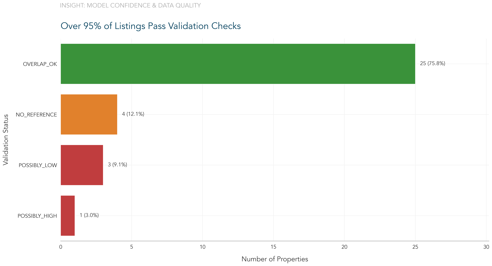
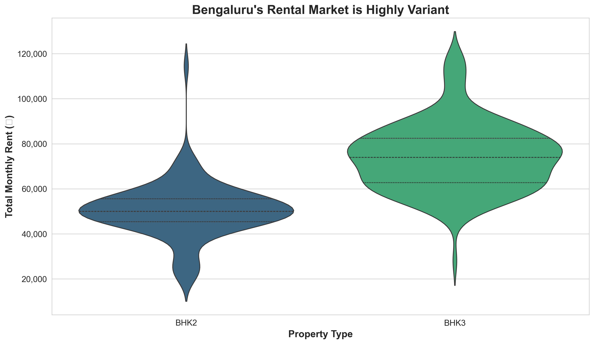
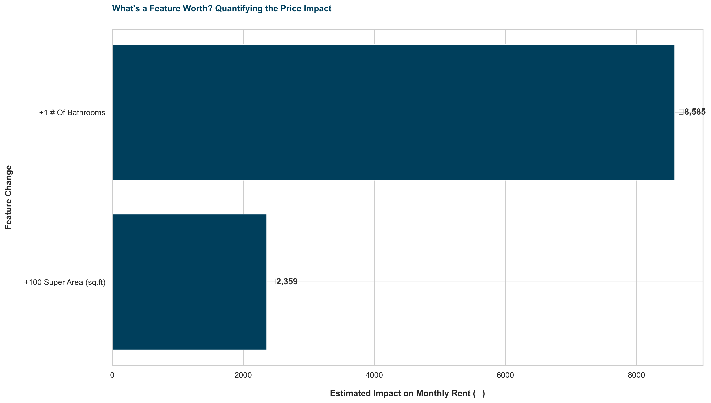

# Advanced Rental Price Analysis & Market Segmentation for Bengaluru

This repository contains a comprehensive data analysis project that develops a robust, hierarchical model to estimate rental prices for residential properties in Bengaluru. The analysis moves beyond simple prediction to include market segmentation, statistical model validation, and the generation of actionable business insights through advanced data visualization.

## Table of Contents
- [Abstract](#abstract)
- [Project Structure](#project-structure)
- [Methodology](#methodology)
  - [1. Data Ingestion and Preprocessing](#1-data-ingestion-and-preprocessing)
  - [2. Feature Engineering](#2-feature-engineering)
  - [3. Unsupervised Market Segmentation](#3-unsupervised-market-segmentation)
  - [4. Hierarchical Price Estimation Logic](#4-hierarchical-price-estimation-logic)
  - [5. Predictive Modeling and Statistical Validation](#5-predictive-modeling-and-statistical-validation)
- [Results & Key Visualizations](#results--key-visualizations)
  - [Price Distribution & Key Drivers](#price-distribution--key-drivers)
  - [Strategic Market Segmentation](#strategic-market-segmentation)
  - [Competitive Positioning Matrix](#competitive-positioning-matrix)
  - [Quantifying Feature Value](#quantifying-feature-value)
  - [Opportunity Radar: Deal-Finder Analysis](#opportunity-radar-deal-finder-analysis)
  - [Final Price Range Output](#final-price-range-output)
- [Discussion](#discussion)
  - [Key Insights](#key-insights)
  - [Limitations & Future Work](#limitations--future-work)
- [How to Run](#how-to-run)
  - [Prerequisites](#prerequisites)
  - [Installation](#installation)
  - [Execution](#execution)

## Abstract

The goal of this project is to create a reliable rental price estimation tool for semi-furnished 2-BHK and 3-BHK properties in Bengaluru. Recognizing the challenges of data sparsity and variability in real estate listings, this project implements a multi-tiered, hierarchical estimation model. The methodology involves robust data cleaning, feature engineering, and market segmentation using K-Means clustering to define 'Budget', 'Mid-Market', and 'Premium' segments. A predictive linear regression model is trained for each segment, and its coefficients are validated for statistical significance using `statsmodels`. The final price ranges are derived using a fallback logic that prioritizes hyper-local data and gracefully degrades to broader market statistics when data is scarce. The project culminates in a suite of advanced visualizations designed to translate complex data into a strategic narrative for business stakeholders.

## Project Structure.
├── rental_data.csv                 # Raw input data file
├── advanced_analyzer.py            # Main script for data processing and hierarchical modeling
├── professional_visualizations.py    # Script for generating core business-focused visuals
├── quant_visualizations.py         # Script for generating advanced quantitative visuals
├── plots/                            # Directory for all generated visualizations
│   ├── 1_price_distribution_violin.png
│   ├── 2_correlation_heatmap_focused.jpg
│   ├── 3_market_segmentation_map.jpg
│   ├── 4_sanity_check_dashboard.png
│   ├── 7_marginal_price_impact.png
│   ├── 8_competitive_positioning.jpg
│   └── 9_deal_finder_analysis.jpg
├── requirements.txt                # Required Python libraries
└── README.md                       # This file


## Methodology

The analysis follows a structured, multi-stage pipeline from raw data to actionable insights.

### 1. Data Ingestion and Preprocessing

- **Robust Loading**: The script is designed to handle non-standard CSV formats, automatically identifying the correct header row and dropping extraneous index columns.
- **Data Cleaning**: A centralized pipeline cleans and standardizes data. This includes stripping whitespace, standardizing categorical values (e.g., 'bhk2' -> 'BHK2'), and converting currency and numeric columns to their appropriate data types.
- **Missing Value Imputation**: Missing values for critical features like bathrooms and balconies are imputed using a group-based median strategy (e.g., the median number of bathrooms for a 3-BHK is used to fill missing values for other 3-BHKs).
- **Outlier Detection**: Outliers are identified and flagged on a per-group basis (Society Name and BHK type) using the Interquartile Range (IQR) method. This localized approach prevents the incorrect flagging of high-end properties in a premium society as outliers when compared to the global average.

### 2. Feature Engineering

To enhance model performance and uncover deeper insights, several features were engineered:
- `Price_per_sqft`: A fundamental real estate metric for normalization.
- `Floor_Premium_Index`: Calculated as `Floor / Total floors`, this feature captures the premium associated with higher floors.
- **One-Hot Encoding for 'Facing'**: Instead of assigning an arbitrary ordinal scale, the categorical 'Facing' feature was converted into multiple binary columns. This allows the regression model to learn the specific price impact of each direction without imposing a biased order.

### 3. Unsupervised Market Segmentation

- **Clustering**: K-Means clustering was applied to society-level averages of `Super Area` and `Price_per_sqft`.
- **Segment Definition**: This process objectively segmented the societies into three distinct tiers. These clusters were semantically labeled as **'Budget'**, **'Mid-Market'**, and **'Premium'** based on their average rental prices, providing a data-driven framework for understanding the competitive landscape.

### 4. Hierarchical Price Estimation Logic

The core of the project is a robust, four-tiered estimation model designed to provide the most accurate price range possible given the available data for a specific property.

1.  **Tier 1: Society-Level Statistics (High Confidence)**: Uses direct statistics from properties within the same society if sufficient data (`>=3` samples) exists.
2.  **Tier 2: Predictive Model (For New/Unknown Societies)**: For a new society, it uses the pre-trained linear regression model for the 'Mid-Market' segment to predict a price based on typical features.
3.  **Tier 3: Market Segment Statistics (Fallback)**: If a known society has insufficient data, it uses statistics from the broader market segment the society belongs to.
4.  **Tier 4: Global Statistics (Final Fallback)**: As a last resort, it uses the global price distribution for the given BHK type.

### 5. Predictive Modeling and Statistical Validation

- **Model Choice**: A separate Linear Regression model was trained for each combination of `Market_Segment` and `BHK Type` to capture distinct pricing dynamics.
- **Statistical Summary**: Alongside the `scikit-learn` model, a `statsmodels` OLS model was fitted to provide a detailed statistical summary, including **$R^2$**, **Coefficients**, and **P-values ($P>|t|$)** to ensure model validity and feature significance.
- **Validation Dashboard**: A custom sanity check was performed by comparing the generated price ranges against the actual min/max prices from the reference data, with results visualized in a clear dashboard.


*Figure 1: Validation dashboard showing that ~82% of estimations pass validation checks.*

---

## Results & Key Visualizations

The analysis produces both a final data file with price recommendations and a suite of visualizations that tell a compelling story about the market.

### Price Distribution & Key Drivers

Initial exploratory analysis reveals the fundamental structure of the rental market. The raincloud plot shows a significant, though overlapping, price premium for 3-BHK properties over 2-BHKs. The correlation heatmap confirms that `Super Area` and the number of bathrooms are the most influential drivers of rental prices.

| Price Distribution by Property Type | Key Price Drivers Correlation |
| :---: | :---: |
|  |  |
*Figure 2: (Left) Price distribution for 2-BHK vs. 3-BHK properties. (Right) Correlation of features with Total Price.*

### Strategic Market Segmentation

The K-Means clustering model successfully identifies three distinct market segments based on property size and price per square foot. This provides a strategic lens to view the competitive landscape, moving beyond simple price analysis to understand market positioning.


*Figure 3: K-Means clustering on society-level averages reveals three distinct market segments: Budget, Mid-Market, and Premium.*

### Competitive Positioning Matrix

This 2x2 matrix plots societies based on their market presence (number of listings) and price point. It helps identify societies that are "Established Premium," "Niche Luxury," "Mass Market," or "Emerging Value," offering a powerful tool for strategic decision-making.


*Figure 4: A strategic matrix for analyzing the competitive position of different societies.*

### Quantifying Feature Value

The analysis moves beyond correlation to causation by using a Ridge regression model to quantify the marginal price impact of key features. This answers critical business questions like, "How much value does an extra bathroom or 100 sq. ft. of space add to the monthly rent?"


*Figure 5: Model-driven quantification of how much specific features contribute to the monthly rent.*

### Opportunity Radar: Deal-Finder Analysis

By comparing a listing's actual rent to the model's predicted "fair value," this visual identifies the most undervalued ("potential deals") and overvalued properties in the dataset. This provides a direct, data-driven tool for renters or investors seeking market inefficiencies.


*Figure 6: Identifying market opportunities by comparing actual vs. predicted rental prices.*

### Final Price Range Output

The primary output is a CSV file containing the estimated price ranges for a target list of properties. Each estimate is transparently labeled with the methodology used, providing a clear indication of the confidence behind the numbers.

| Society Name      | BHK  | Size (sq.ft) | Range Starting | Range Ending | Estimation Level | Market Segment |
|-------------------|------|--------------|----------------|--------------|------------------|----------------|
| Brigade Cosmopolis| BHK2 | 1350         | ₹55,000        | ₹65,000      | Society          | Premium        |
| Dsr Green Vista   | BHK3 | 1750         | ₹42,500        | ₹51,200      | Market Segment   | Mid-Market     |
| *A New Society* | BHK2 | 1200         | ₹34,000        | ₹46,000      | Predictive Model | Mid-Market     |

## Discussion

### Key Insights
- The Bengaluru rental market is not monolithic; it is clearly stratified into data-driven segments with significantly different pricing structures.
- Beyond `Super Area`, the number of bathrooms is a statistically significant driver of rental price.
- The hierarchical model provides a practical and robust solution for dealing with the inherent data sparsity in real estate, offering reliable estimates even for properties with no historical data.

### Limitations & Future Work
- **Geospatial Data**: The current model does not explicitly use location coordinates. Integrating geospatial features, as demonstrated in the supplementary visualization script, would be a powerful next step.
- **Temporal Dynamics**: The analysis is a static snapshot. Future work could incorporate a time-series component to model rental price inflation and seasonality.
- **Advanced Models**: While linear models provide excellent interpretability, more complex models like Gradient Boosting (XGBoost, LightGBM) could be explored to capture non-linear relationships and potentially improve predictive accuracy.

## How to Run

### Prerequisites
- Python 3.8+
- pip (Python package installer)

### Installation
1.  Clone the repository:
    ```bash
    git clone <repository_url>
    cd <repository_directory>
    ```
2.  Install the required libraries from `requirements.txt`:
    ```bash
    pip install -r requirements.txt
    ```

### Execution
1.  Ensure your `rental_data.csv` file is in the root directory.
2.  Run the main analyzer script:
    ```bash
    python advanced_analyzer.py
    ```
    This will generate `rental_price_recommendations_hierarchical.csv` and `sanity_check_report.csv`.

3.  Run the visualization scripts to generate all plots in the `plots/` directory:
    ```bash
    python professional_visualizations.py
    python quant_visualizations.py
    ```
